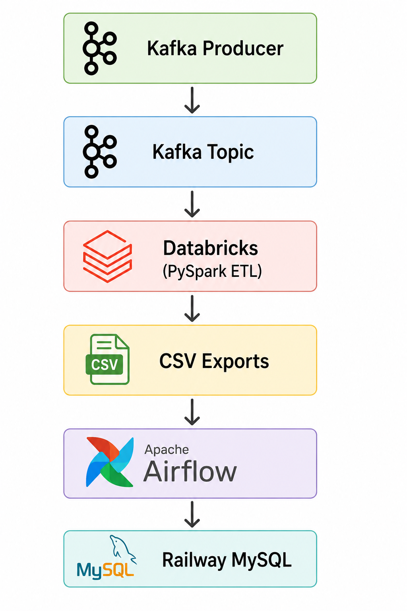
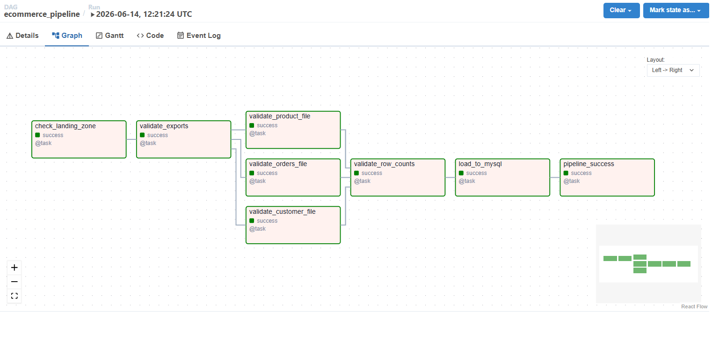
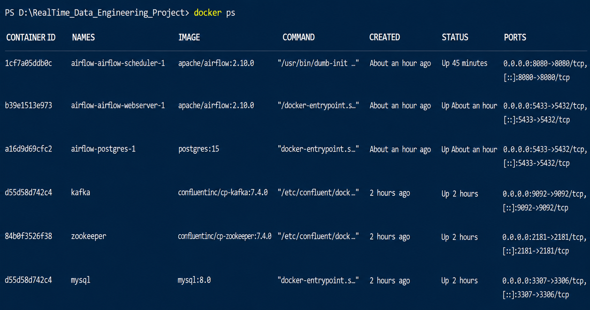
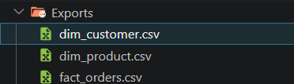

# Real-Time E-Commerce Data Engineering Pipeline



## Project Highlights

- Real-time event ingestion using Kafka
- Bronze, Silver, Gold Medallion Architecture
- Databricks ETL processing with PySpark
- Airflow orchestration and monitoring
- Data quality validation checks
- Railway MySQL data warehouse loading
- Dockerized local infrastructure
-----

## Overview

This project demonstrates an end-to-end real-time data engineering pipeline built using Apache Kafka, Databricks, Airflow, Docker, and Railway MySQL.

The pipeline ingests e-commerce events through a Flask API, streams data using Kafka, processes data in Databricks using the Medallion Architecture (Bronze, Silver, Gold), and orchestrates validation and loading into MySQL using Apache Airflow.

# Real-Time Ecommerce Data Engineering Pipeline

## Overview

This project demonstrates a complete end-to-end Data Engineering pipeline built using modern data engineering tools and practices.

The pipeline simulates ecommerce transactions, processes them using Databricks and PySpark, orchestrates workflow execution with Apache Airflow, and loads curated data into a MySQL data warehouse hosted on Railway.

---
## Tech Stack

- Python
- Flask API
- Apache Kafka
- Docker
- Databricks
- PySpark
- Delta Lake
- Apache Airflow
- MySQL
- Railway

## Architecture

```text
Ecommerce Data Generator
            │
            ▼
      Kafka Producer
            │
            ▼
       Kafka Topic
            │
            ▼
       Databricks
      (PySpark ETL)
            │
            ▼
       CSV Exports
            │
            ▼
       Apache Airflow
            │
            ▼
    Data Validation Layer
            │
            ▼
      Railway MySQL
```
## Project Structure

```text
Airflow/
Consumer/
Databricks/
Flask_api/
My_Sql/
screenshots/

Load_to_railway.py
docker-compose.yml
requirements.txt
README.md
```

## Workflow

### Step 1 – Generate Transactions

Python scripts generate ecommerce transaction data and publish records to Kafka.

---

### Step 2 – Consume Kafka Data

Databricks consumes Kafka events and stores them in Spark DataFrames.

---

### Step 3 – Transformation Layer

PySpark performs:

* Data Cleaning
* Fact Table Creation
* Dimension Table Creation
* Data Quality Checks

Generated tables:

* dim_customer
* dim_product
* fact_orders

---

### Step 4 – Export Layer

Databricks exports transformed datasets:

* Exports/dim_customer.csv
* Exports/dim_product.csv
* Exports/fact_orders.csv

---

### Step 5 – Airflow Orchestration

Airflow executes the pipeline:

1. Check project availability
2. Validate export files
3. Validate row counts
4. Execute Railway load process
5. Mark pipeline success

---

### Step 6 – Warehouse Load

The loader script:

* Creates tables if needed
* Clears existing data
* Loads fresh data
* Commits transaction

---

## Airflow DAG

Tasks:

```text
check_landing_zone
        │
        ▼
validate_exports
        │
        ▼
 ┌─────────────────────┐
 │ validate_customer   │
 │ validate_product    │
 │ validate_orders     │
 └─────────────────────┘
        │
        ▼
validate_row_counts
        │
        ▼
load_to_mysql
        │
        ▼
pipeline_success
```

---
## Project Screenshots

### Airflow DAG Success



### Docker Containers



### Generated Exports



## Data Quality Checks

Implemented validations:

* Export file existence
* Empty file detection
* Row count validation
* Load failure detection

---

## Key Features

* End-to-End Pipeline
* Real-Time Kafka Integration
* PySpark Transformations
* Airflow Orchestration
* Dockerized Infrastructure
* Railway Cloud Warehouse
* Data Validation Layer
* Idempotent Loading

---

## Future Enhancements

* Airflow-triggered Databricks execution
* Airflow Connections and Variables
* Incremental loading
* Power BI dashboard
* CI/CD with GitHub Actions
* Monitoring and alerting

---

## Author

Aayush Kumar
Data Engineering Project
