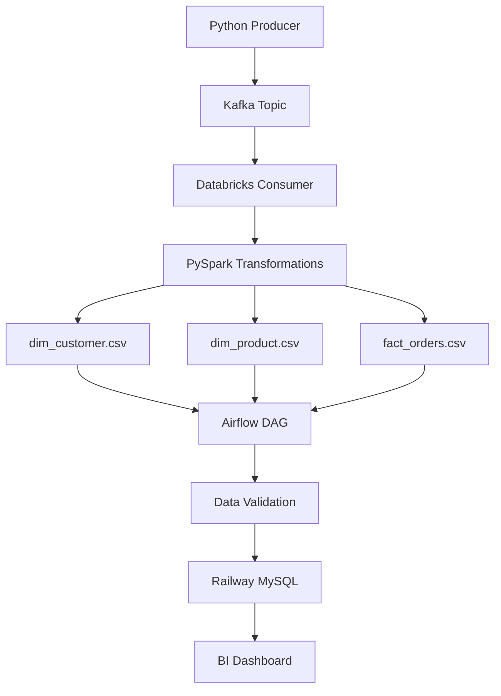

# Architecture

```mermaid
flowchart TD

A[Python Producer] --> B[Kafka Topic]

B --> C[Databricks Consumer]

C --> D[PySpark Transformations]

D --> E[dim_customer.csv]
D --> F[dim_product.csv]
D --> G[fact_orders.csv]

E --> H[Airflow DAG]
F --> H
G --> H

H --> I[Data Validation]

I --> J[Railway MySQL]

J --> K[BI Dashboard]
```